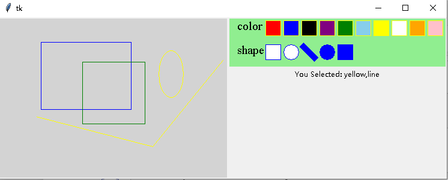
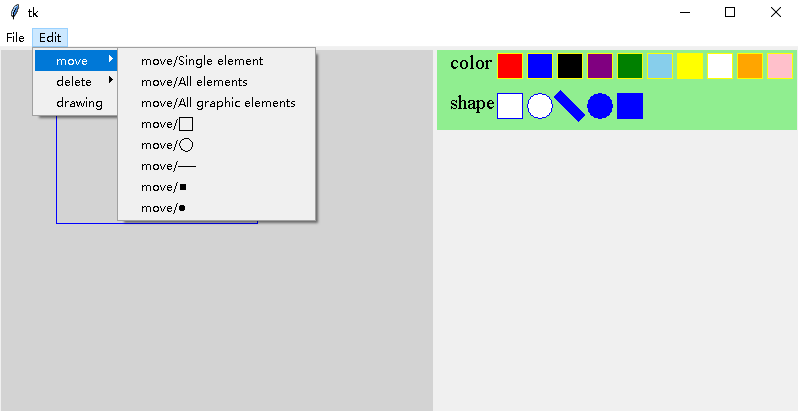
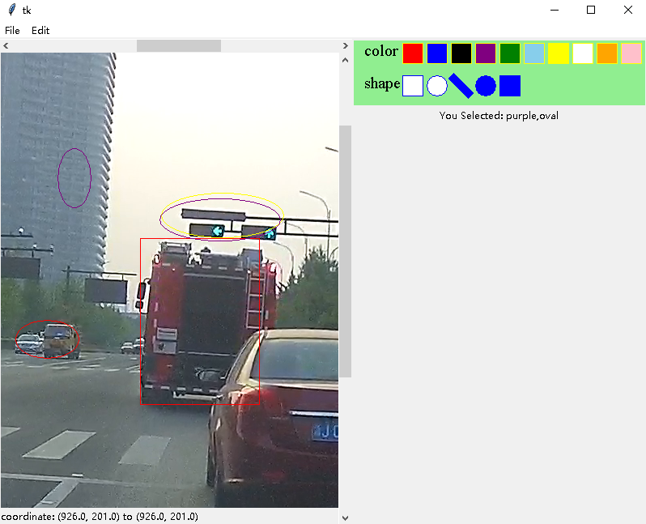

# User manual

For illustration purposes, we load the graph-related libraries directly:

```python
from tkinter import Tk, Toplevel, ttk, StringVar
from graph_tensor.graph.atom import Meta, Drawing, TrajectoryDrawing
from graph_tensor.graph.atom import Graph, GraphScrollable
```

## Meta provides a unified drawing interface for Canvas

`Meta` is inherited from the `Canvas` class of tkinter, and its main improvement is that a uniform interface function is customized for the drawing function. Examples of Meta's use:

```python
def test_Meta():
    root = Tk()
    root.columnconfigure(0, weight=1)
    root.rowconfigure(0, weight=1)
    self = Meta(root)
    kw = {
        'color': 'purple',
        'dash': 2,
        'width': 2,
        'tags': 'test '
    }
    self.draw_graph('line', [20, 20, 100, 200], **kw)
    self.draw_graph('oval', [50, 80, 100, 200], fill='red', **kw)
    self.draw_graph('rectangle', [170, 80, 220, 200], fill='yellow', **kw)
    self.draw_graph('arc', [180, 100, 250, 260],
                    fill='lightblue', style='chord', **kw)
    self.draw_graph('polygon', [(70, 80), (20, 70), (30, 90)], fill='purple', **kw)
    self.layout(row=0, column=0)
    print(self.gettags(1))
    print(self.find_withtag('graph'))
    root.mainloop()
```

Show:


## Drawing provides a tool to draw with the mouse

Create graphic elements (graph) including rectangular boxes (which can be square points,ovals (circular points), and segments. Press the left mouse button to start painting, release the left mouse button for the end of the painting.

Test:

```python
from graph_tensor.graph.test import test_Drawing
test_Drawing()
```

Show:



`TrajectoryDrawing` is a subclass of `Drawing`. Click the left mouse button to start painting, move the left mouse button after_time complete the painting.

```python
from graph_tensor.graph.creator import SelectorFrame
root = Tk()
selector = SelectorFrame(root)
meta = TrajectoryDrawing(root, selector, after_time=370, background='lightgray')
# Makes the master widget change as the canvas size
root.columnconfigure(0, weight=1)
root.rowconfigure(0, weight=1)
meta.layout()
selector.layout()
selector.grid(row=0, column=1, sticky='nwes')
root.mainloop()
```

## Graph is a drawing tool for manipulating graphic objects

```python
def test_GraphWindow():
    from graph.creator import SelectorFrame
    from graph.tk_utils import Window
    # Window sets up a toolbar window for the image labeling tool
    root = Window()
    root.geometry('600x800')
    selector = SelectorFrame(root)
    graph = Graph(root, selector, background='lightgray')
    root.update_edit_menu(graph)
    root.update_file_menu(graph)
    # Makes the master widget change as the canvas size
    graph.layout()
    selector.layout()
    selector.pack(side='right', fill='y')
    root.mainloop()
test_GraphWindow()
```

Added moves and deletions to graphic objects.

Show:



`Seek filename` in the `File` option in the menu bar can load the picture. Move, delete, and draw in the Edit options in the menu bar.

`GraphScrollable` is a subclass of G`raph`', which adds a scroll bar to the picture and sets the picture to be immobile.


