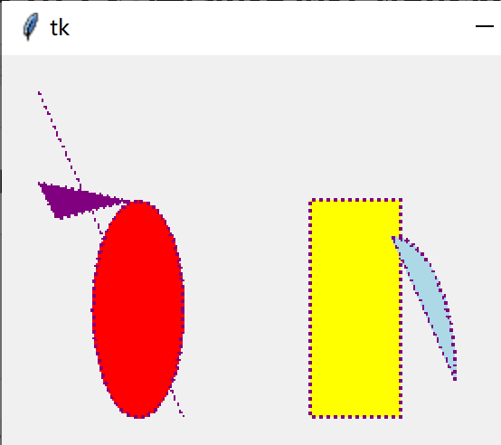

# User manual

For illustration purposes, we load the graph-related libraries directly:

```python
from tkinter import Tk, Toplevel, ttk, StringVar
from graph_tensor.graph.atom import Meta, Drawing, TrajectoryDrawing
from graph_tensor.graph.atom import Graph, GraphScrollable
```

## Meta provides a unified drawing interface for Canvas

`Meta` is inherited from the `Canvas` class of tkinter, and its main improvement is that a uniform interface function is customized for the drawing function. Examples of Meta's use:

```python
def test_Meta():
    root = Tk()
    root.columnconfigure(0, weight=1)
    root.rowconfigure(0, weight=1)
    self = Meta(root)
    kw = {
        'color': 'purple',
        'dash': 2,
        'width': 2,
        'tags': 'test '
    }
    self.draw_graph('line', [20, 20, 100, 200], **kw)
    self.draw_graph('oval', [50, 80, 100, 200], fill='red', **kw)
    self.draw_graph('rectangle', [170, 80, 220, 200], fill='yellow', **kw)
    self.draw_graph('arc', [180, 100, 250, 260],
                    fill='lightblue', style='chord', **kw)
    self.draw_graph('polygon', [(70, 80), (20, 70), (30, 90)], fill='purple', **kw)
    self.layout(row=0, column=0)
    print(self.gettags(1))
    print(self.find_withtag('graph'))
    root.mainloop()
```

Show:



## Drawing provides a tool to draw with the mouse